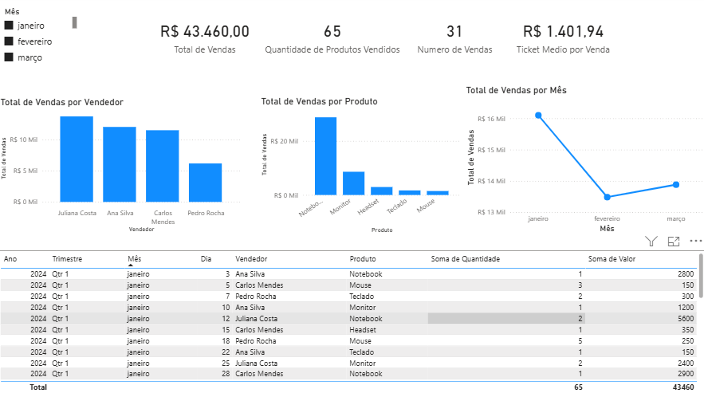

# Dashboard de Vendas – Power BI

Projeto de dashboard desenvolvido em Power BI para análise de desempenho de vendas,
com indicadores e visualizações interativas.

## KPIs
- Total de Vendas
- Quantidade de Produtos Vendidos
- Número de Vendas
- Ticket Médio por Venda

## Análises
- Vendas por vendedor
- Vendas por produto
- Evolução mensal das vendas
- Filtro interativo por mês

## Ferramentas
- Power BI Desktop
- DAX
- Dados fictícios para simulação de cenário real

## Status
Projeto finalizado

